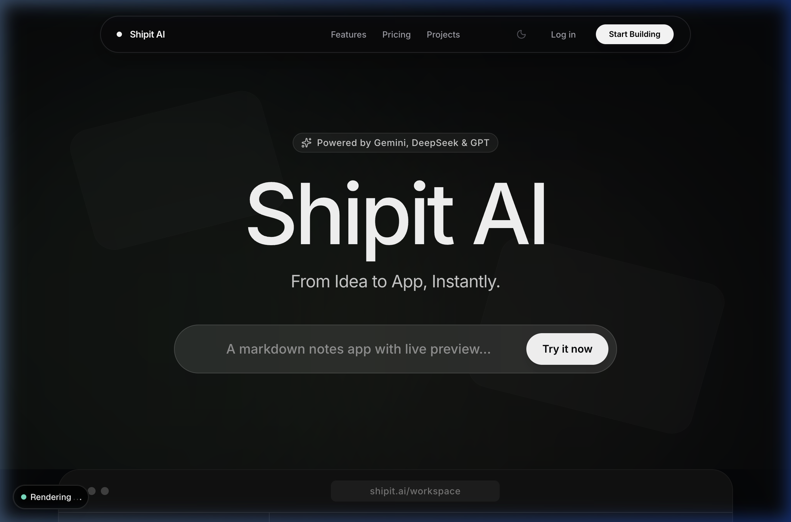
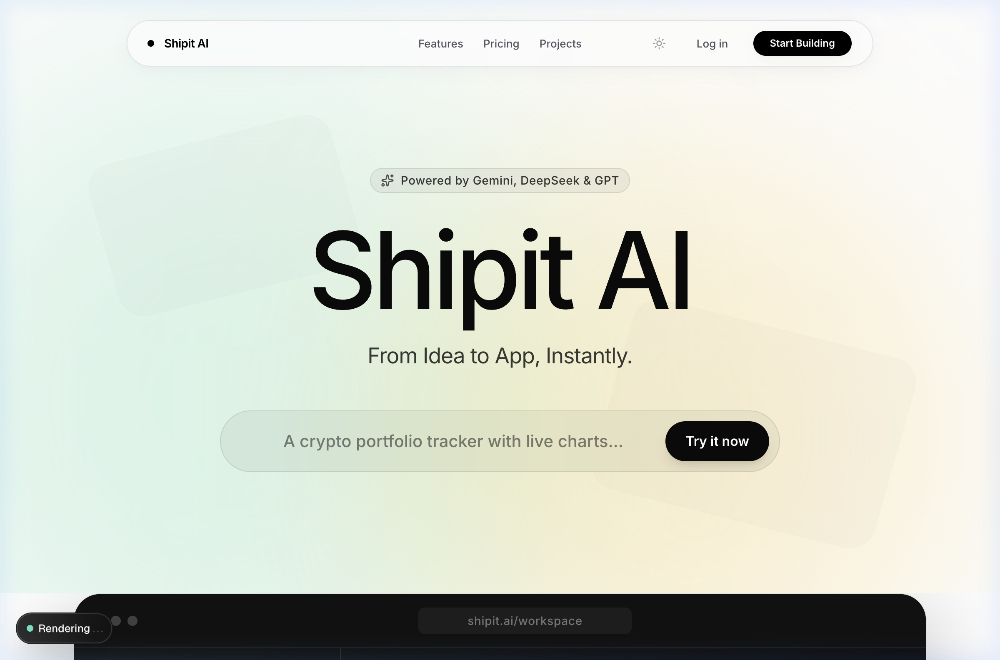
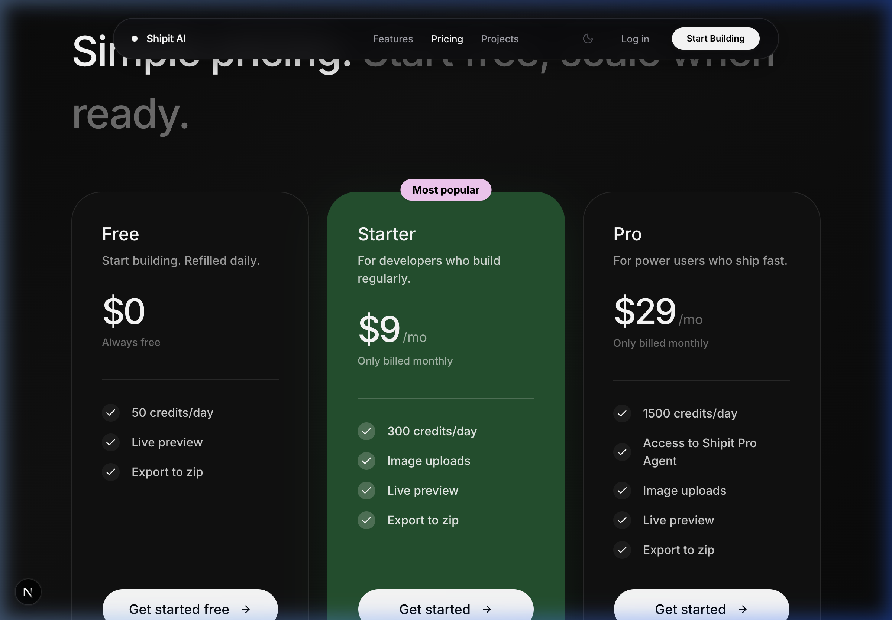
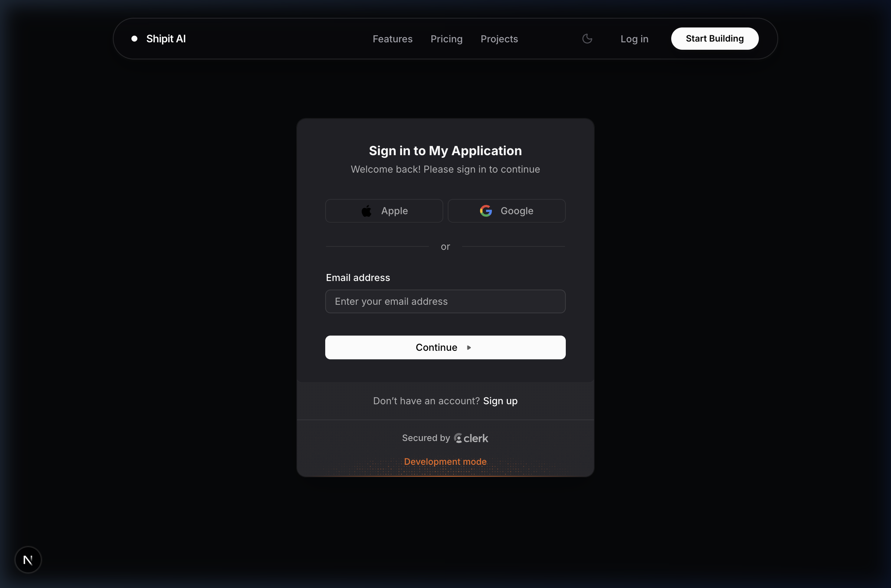
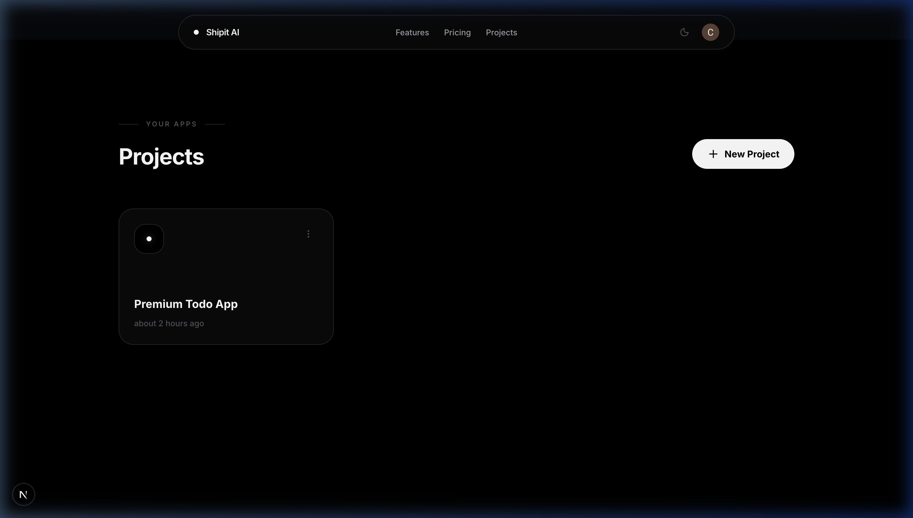
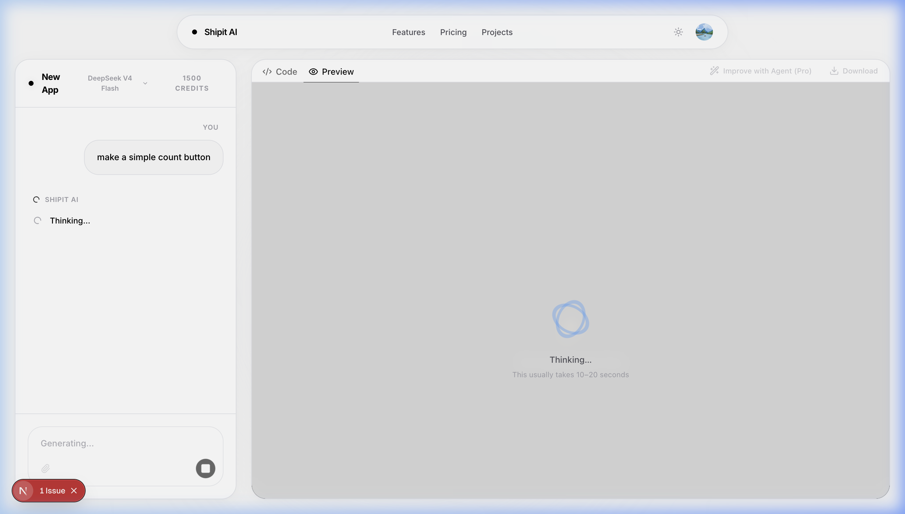
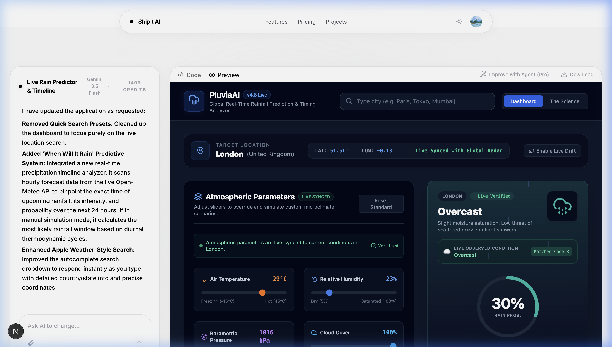
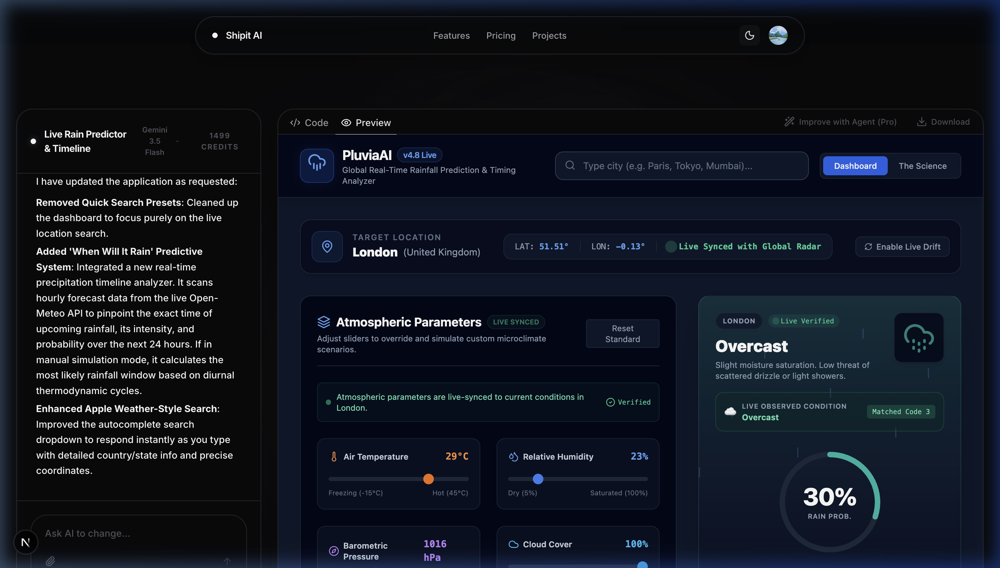

# Shipit AI — Turn Prompts into React Apps

A next-generation, full-stack AI-powered React application generator. Users describe their app ideas in plain English, and the platform instantly generates production-ready, beautiful React + Tailwind code that renders live in the browser. 

It integrates persistent workspace histories, smart npm package validation, an in-browser live Sandpack preview, and a credit-based subscription model with Clerk billing.

---

## 📋 Table of Contents

- [Overview](#overview)
- [Tech Stack](#tech-stack)
- [File & Directory Structure](#file--directory-structure)
- [Key Features](#key-features)
- [Database Structure](#database-structure)
- [Website Previews](#-website-previews)

---

## 📖 Overview

Shipit AI is designed to help developers and designers bootstrap functional, interactive components and layouts instantly. 

The workspace split-panel layout features an AI Chat assistant on the left, and an interactive Sandpack Code Editor + Live Browser Preview on the right. When the browser preview throws compilation or runtime errors, a visual banner offers **Auto-Fix with AI**, sending the stack trace back to the model to resolve the bug automatically.

---

## 🛠️ Tech Stack

| Layer | Technology & Implementation File |
|---|---|
| **Framework** | Next.js 16 (App Router, Turbopack, TS, utilizing custom `proxy.ts` middleware standard) |
| **Authentication** | Clerk (Google OAuth, User Sync via secure middleware in `proxy.ts`) |
| **Billing & Credits** | Clerk Billing Toggle (`NEXT_PUBLIC_CLERK_BILLING_ENABLED`, plan tiers resolved in `lib/checkUser.ts`, credits deducted transactionally in `app/api/gen-ai-code/route.ts`) |
| **Database & ORM** | Supabase PostgreSQL + Prisma ORM (`prisma/schema.prisma` & `lib/prisma.ts`) |
| **Supabase Client API** | `@supabase/supabase-js` (Initialized client-side in `components/ChatPanel.tsx` to handle direct media uploads) |
| **File Storage** | Supabase Storage Bucket (`WORKSPACE-IMAGES` public bucket with customized RLS rules for anonymous uploads) |
| **Security & WAF** | Arcjet WAF (`lib/arcjet.ts` for route-level prompt injection and rate limits; `proxy.ts` for global shield and bot detection) |
| **AI Models** | Google Gemini 3.5 Flash, DeepSeek V4 Flash, DeepSeek V4 Pro, & OpenAI GPT OSS 120B |
| **AI Integration** | `@google/genai` SDK for Gemini; standard `openai` client for NVIDIA-hosted endpoints |
| **AI Agent Interface** | `@cline/sdk` (Pro-only multi-file workspace improvements agent in `app/api/improve/route.ts`) |
| **Sandbox Environment** | `@codesandbox/sandpack-react` (Live in-browser preview container and file browser in `components/WorkspaceClient.tsx`) |
| **Styling** | Tailwind CSS v4 |

---

## 📁 File & Directory Structure

To help navigate the codebase, here is the structural mapping of core features:

*   **Supabase Storage Uploads**: Located in [ChatPanel.tsx](file:///Users/chetanmeshram/Shipit%20AI/components/ChatPanel.tsx) (`@supabase/supabase-js` client uploads design screenshots to the `WORKSPACE-IMAGES` bucket).
*   **Database Config & Client**: Configured in [schema.prisma](file:///Users/chetanmeshram/Shipit%20AI/prisma/schema.prisma) and initialized in [prisma.ts](file:///Users/chetanmeshram/Shipit%20AI/lib/prisma.ts) (connects to Supabase Postgres).
*   **User Synchronization & Daily Refills**: Handled in [checkUser.ts](file:///Users/chetanmeshram/Shipit%20AI/lib/checkUser.ts) (auto-checks date on login, refills credits daily, and registers subscription hierarchy upgrades).
*   **Security & Auth Middleware**: Located in [proxy.ts](file:///Users/chetanmeshram/Shipit%20AI/proxy.ts) (shields against bot scraping, runs Clerk auth guard, and applies proxy routing).
*   **App Generation API Route**: Located in [route.ts](file:///Users/chetanmeshram/Shipit%20AI/app/api/gen-ai-code/route.ts) (executes token-bucket security, dynamic model client routing, streams reasoning updates, performs npm package validation, and runs credit transaction logs).
*   **Improve Agent API Route**: Located in [route.ts](file:///Users/chetanmeshram/Shipit%20AI/app/api/improve/route.ts) (pro-only multi-file `@cline/sdk` workspace refactoring agent).
*   **Server Actions**: Located under `actions/` (`billing.ts` resolves active plans, `projects.ts` manages workspace deletion and query list items, and `workspace.ts` returns active files).

---

## 🌟 Key Features

### 1. Multi-Model AI Orchestration
*   Choose between four powerful models from Google, DeepSeek, and OpenAI directly from the workspace selector.
*   **Google Gemini 3.5 Flash**: Fast generation and suggestion responses.
*   **DeepSeek V4 Flash**: Rapid, logic-driven reasoning model.
*   **DeepSeek V4 Pro**: NVIDIA-hosted highly capable reasoning model for complex layouts.
*   **OpenAI GPT OSS 120B**: NVIDIA-hosted massive 120B parameter model.
*   **Robust Parsing Engine**: Utilizes a custom JSON bracket extractor that cleanly sanitizes LLM responses (stripping markdown wraps and reasoning `<think>` tags) to prevent parsing errors.

### 2. Multi-File Code Improvements (Pro Feature)
*   Integrates an interactive **Improve** panel powered by `@cline/sdk` multi-file agents.
*   Emits live SSE file patches as the agent works, updating code in the browser in real-time.

### 3. Dynamic Landing Page Suggestions
*   Pulls coding suggestions dynamically across all configured models to reduce single-provider rate-limit issues.
*   Visual badge status:
    *   `✨ Live AI trends` (Pulsing green indicator): Suggestions fetched live from the AI models.
    *   `📋 Default suggestions` (Amber indicator): Rotates a local pool of 12 developer fallback templates loaded if APIs are offline.

### 4. Multimodal Design Uploads
*   Supports visual mockups and screenshot uploads.
*   Images are saved securely in the Supabase bucket, converted to Base64, and sent to Google Gemini for design parsing and code translation.

### 5. Smart npm Dependency Validator
*   Before code is loaded into the Sandpack sandbox, the server verifies package imports against the official npm registry (`registry.npmjs.org`), filtering out hallucinated packages.

### 6. Interactive Sandbox & Code Export
*   Features a split pane with an interactive CodeMirror editor and a live sandboxed browser frame.
*   Includes a **Download** option to package the entire project structure into a standard React ZIP.

### 7. Auto-Fix with AI
*   When the browser preview throws runtime errors, a visual banner offers to auto-resolve the issue by sending the error log back to the AI for patching.

---

## 🗄️ Database Structure

The database configuration utilizes two primary Postgres tables managed by Prisma:

*   **User**: Syncs authenticated users from Clerk, tracks active subscription plans (`plan`: free, starter, pro), allocates daily credits (`credits`), and records usage intervals (`lastRefillAt`).
*   **Workspace**: Stores sandbox layouts, referencing `User` via `userId` (Cascade delete). Stores persistent chat logs (`messages` JSON array) and active project structure (`fileData` JSON including files, code, and validated dependencies).
*   **Storage Bucket**: `WORKSPACE-IMAGES` on Supabase Storage (Anonymous SELECT/INSERT RLS rules).

---

## 📸 Website Previews

### 1. Landing Page (Dark Mode)

### 2. Landing Page (Light Mode)

### 3. Pricing Section (Tiers & Features)

### 4. Authentication (Sign In / Sign Up)

### 5. Projects Dashboard (Active Workspaces)

### 6. App Generation (Thinking State & Progress)

### 7. Workspace Dashboard - Light Mode (Pluvia AI App)

### 8. Workspace Dashboard - Dark Mode (Pluvia AI App)

